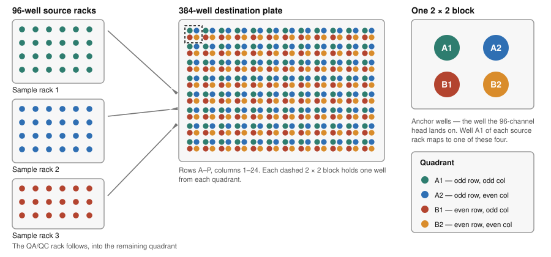

# Opentrons Flex Protocols for 384-Well Sample Preparation for Nontargeted Exposomics

Python-based Opentrons Flex protocols and labware definitions for ultra-high-throughput protein-precipitation sample preparation of biosamples, performed in the 384-well format. These protocols automate the sample preparation workflow described in:

> **An Ultra-High-Throughput 384-Well Sample Preparation Workflow for Nontargeted Exposomics Across Four LC-HRMS Assays**
> [Author list and journal citation to be added upon publication]

## Overview

This repository contains two protocols for the Opentrons Flex liquid handler that prepare a full 384-well plate — up to **288 study samples plus up to 96 QA/QC materials** — using only **30 µL sample**.

A single protein-precipitation extraction is divided into aliquots for two complementary chromatographic platforms, each acquired in positive and negative electrospray ionization mode, yielding **four nontargeted assays from one preparation**.

Sample preparation requires approximately **75 minutes**, comprising approximately 45 minutes of active labor and 30 minutes of unattended equilibration.

The protocols employ the Opentrons Flex 96-channel 1000 µL pipette. Because the 96-channel head has 9 mm tip spacing and a 384-well plate has 4.5 mm well spacing, a single tip pickup addresses one quarter of the plate — see [96-well to 384-well mapping](#96-well-to-384-well-mapping) below.

## Workflow

| Step | Protocol | Description | Hands-on time |
|------|----------|-------------|---------------|
| 1 | — | **Off-robot:** Thaw plasma at 4 °C (1 h). Set temperature modules, centrifuge and thermomixer to 4 °C; preheat heat sealer to 165 °C | ~5 min |
| 2 | — | **Off-robot:** Vortex-mix racks 10 min at 1,100 rpm, 4 °C; centrifuge 2 min at 4,500 rpm, 4 °C | ~5 min |
| 3 | — | **Off-robot:** Scan sample racks and verify sample IDs against the run list | ~5 min |
| 4 | `step1_solvent_addition_and_sample_aliquoting.py` | Dispense 90 µL extraction solvent into the 384-well plate, then 30 µL plasma from each source rack | ~10 min |
| 5 | — | **Off-robot:** Heat-seal at 165 °C for 1.5 s and press with a roller | ~2 min |
| 6 | — | **Off-robot:** Vortex-mix 30 min at 1,100 rpm, 4 °C to precipitate protein and extract analytes. *Unattended* — prepare Step 2 and return remaining samples to −80 °C storage during this interval | ~2 min |
| 7 | — | **Off-robot:** Centrifuge 2 min at 4,500 rpm, 4 °C to pellet precipitated protein | 2 min |
| 8 | `step2_dilution_and_supernatant_transfer.py` | Dispense 60 µL water into the C18 plate, then transfer 30 µL supernatant to C18 and 40 µL to HILIC | ~10 min |
| 9 | — | **Off-robot:** Heat-seal both plates, centrifuge, then vortex-mix 10 min at 2,000 rpm, 4 °C | ~4 min |

Following Step 9, plates are ready for loading into the LC autosampler.

Hands-on time refers to operator-attended time only and excludes walk-away intervals such as thawing, vortex-mixing and centrifugation, during which the subsequent step may be prepared. The tabulated values sum to the approximately 45 minutes of active labor stated above.

## Protocol Details

### Step 1: Extraction Solvent Addition and Sample Aliquoting

Dispenses 90 µL of extraction solvent (60:40 v/v methanol/acetonitrile containing isotope-labeled internal standards) into each well of an intermediate 384-well plate, then transfers 30 µL of sample from each 96-well Matrix source rack into its assigned quadrant.

**Key features:**
- Solvent tips are pre-wetted three times; in the absence of pre-wetting, volatile organic solvent evaporates within a dry tip and the initial deliveries are volumetrically inaccurate
- Extraction solvent is drawn from a single reservoir well using three columns of the tip head, with a −9 mm X offset that centres those columns within the well, avoiding the substantial overfill that a full-width open reservoir would require
- Leading air plugs and trailing air gaps prevent dripping during pipette movement
- Blow-out is performed above the liquid surface and before tip contact with the well wall, preventing re-aspiration and carryover between wells
- A 4-second post-aspirate delay allows the viscous samples to stabilize within the tip before the pipette head is repositioned
- The protocol pauses between racks, such that only one rack is uncapped and off ice at any time

**Deck layout** (slot occupancy varies with `NUM_SAMPLE_PLATES`):

| Slot | Labware |
|------|---------|
| A1 | 50 µL tip rack (sample rack 1) |
| A2 | 50 µL tip rack (sample rack 2) |
| A3 | 50 µL tip rack (sample rack 3) |
| B1 | Temperature module + Opentrons Tough 4-well 72 mL reservoir, extraction solvent in well A1 (4 °C) |
| B3 | 50 µL tip rack (QA/QC rack) |
| C1 | Temperature module + Thermo Fisher 384-well plate, intermediate (4 °C) |
| C3 | 200 µL tip rack (extraction solvent) — **add tips to columns 1–3 only** |
| D1 | Temperature module + Matrix 96-well tube rack, samples (4 °C) |
| D3 | Trash bin |

**Manual interventions (protocol pauses):**
1. Place the first uncapped sample rack in D1
2. Replace the sample rack between each source rack, concluding with the QA/QC rack

### Step 2: Dilution and Supernatant Transfer

Dispenses 60 µL of UHPLC-MS-grade water into the final C18 plate, then transfers supernatant from the centrifuged intermediate plate to two final plates using a single set of filter tips per quadrant: 30 µL to the C18 plate (a 2:1 dilution into the water previously dispensed) and 40 µL to the HILIC plate.

**Key features:**
- Supernatant is aspirated at a fixed height above the well bottom, clear of the precipitated protein pellet. This can be adjusted depending on the sample volume
- Aspiration is performed at a reduced rate (5 µL/s) to preserve transfer fidelity from the shallow 384-well geometry
- Descent to the aspiration height is speed-limited to avoid disturbing the pellet
- Filter tips are used throughout the supernatant transfer
- A tip-touch against the well wall following each dispense removes residual droplets

**Deck layout:**

| Slot | Labware |
|------|---------|
| A1 | 50 µL filter tip rack (quadrant 1) |
| A2 | 50 µL filter tip rack (quadrant 2) |
| A3 | 50 µL filter tip rack (quadrant 3) |
| B1 | Temperature module + 384-well plate, HILIC final (4 °C) |
| B3 | 50 µL filter tip rack (QA/QC - quadrant 4) |
| C1 | Temperature module + 384-well plate, C18 final (4 °C) |
| C2 | NEST 195 mL reservoir (UHPLC-MS-grade water) |
| C3 | 200 µL tip rack (water) |
| D1 | Temperature module + 384-well plate, intermediate from Step 1 (4 °C) |
| D3 | Trash bin |

**Manual interventions (protocol pauses):**
1. Following water addition: place the centrifuged intermediate plate in D1 and remove its seal

## 96-well to 384-well mapping

The Flex 96-channel head has 9 mm tip spacing; a 384-well plate has 4.5 mm well spacing. A single tip pickup therefore addresses every other row and every other column — one of four interleaved 96-well quadrants. Each quadrant is designated by the well on which the head lands:

| Anchor well | Covers |
|-------------|--------|
| `A1` | odd rows, odd columns |
| `A2` | odd rows, even columns |
| `B1` | even rows, odd columns |
| `B2` | even rows, even columns |

Source racks occupy quadrants in order, and the QA/QC rack occupies the next available quadrant:

| `NUM_SAMPLE_PLATES` | Sample quadrants | QA/QC quadrant | Maximum Study samples |
|---|---|---|---|
| 1 | `A1` | `B1` | 96 |
| 2 | `A1`, `A2` | `B1` | 192 |
| 3 | `A1`, `A2`, `B1` | `B2` | 288 |

Because quadrants are interleaved rather than contiguous, study samples and QA/QC materials are distributed across the entire plate. This arrangement permits plate row and column position effects to be evaluated following acquisition.



### Determining a destination well

For a source well in row *r* (A = 1, B = 2, … H = 8) and column *c* (1–12), the destination well on the 384-well plate is:

```
384 row    = 2r − 1 + row offset        (A = 1, B = 2, … P = 16)
384 column = 2c − 1 + column offset
```

where the offsets are given by the quadrant:

| Quadrant | Row offset | Column offset |
|---|---|---|
| `A1` | 0 | 0 |
| `A2` | 0 | 1 |
| `B1` | 1 | 0 |
| `B2` | 1 | 1 |

Worked examples:

| Source well | → `A1` | → `A2` | → `B1` | → `B2` |
|---|---|---|---|---|
| `A1` | `A1` | `A2` | `B1` | `B2` |
| `C5` | `E9` | `E10` | `F9` | `F10` |
| `D7` | `G13` | `G14` | `H13` | `H14` |
| `H12` | `O23` | `O24` | `P23` | `P24` |

Each quadrant therefore occupies 96 of the 384 wells, and the four quadrants tile the plate exactly with no overlap.

Both destination plates in Step 2 share the source plate geometry, so each quadrant maps directly — anchor `A1` on the intermediate plate corresponds to anchor `A1` on the C18 and HILIC plates. Sample identity is preserved by position, requiring no remapping between Step 1 and Step 2. Each sample should nonetheless be tracked from its 96-well source position to its 384-well destination position and verified against the run list prior to initiating the run.

### QA/QC capacity

The number and composition of QA/QC materials in a batch is not fixed. It depends on the assay, on the study design, and on what the analyst intends to evaluate — for example pooled study material for reproducibility assessment, matrix blanks, solvent blanks, calibration standards, or any combination of these. The QA/QC quadrant is therefore configurable, and should be populated according to the requirements of the assay and batch in question.

**All configurations deliver extraction solvent to the full QA/QC quadrant by default, supporting up to 96 QA/QC materials.** This is an upper limit rather than a requirement: a partially filled QA/QC rack is expected, and wells that receive solvent but no sample are simply left unused. Such wells may be retained as method blanks if desired.

`ES_DEST_WELLS` determines which wells receive extraction solvent and therefore sets this limit. Solvent must reach every well that will receive sample, so the list may be shortened but never below the positions actually in use.

To reduce solvent consumption when fewer QA/QC materials are required, remove B-row anchors from the end of the list. Each anchor covers 24 wells of the QA/QC quadrant:

| B-row anchors retained | QA/QC wells | Extraction solvent, 1 rack | 2 racks | 3 racks |
|---|---|---|---|---|
| all four (default) | 96 | 17.3 mL | 25.9 mL | 34.6 mL |
| first three | 72 | 15.1 mL | 23.8 mL | 32.4 mL |
| first two | 48 | 13.0 mL | 21.6 mL | 30.2 mL |
| first only | 24 | 10.8 mL | 19.4 mL | 28.1 mL |

The QA/QC anchors are `B1`, `B7`, `B13`, `B19` for 1 or 2 sample racks, and `B2`, `B8`, `B14`, `B20` for 3 sample racks. Volumes are dispensed volume only; see [Reagents](#reagents) for dead-volume guidance.

The corresponding QA/QC well positions should be recorded in the run list.

## Requirements

- **Robot:** Opentrons Flex
- **Software:** Opentrons App 8.2.0 or later
- **API Level:** 2.20
- **Pipette:** Flex 96-channel 1000 µL
- **Modules:** 3 × Temperature Module Gen2 per protocol (deck slots B1, C1, D1)

### Labware

| Item | Opentrons API load name | Part Number | Used In |
|------|-------------------------|-------------|---------|
| Opentrons Flex 96 tip rack, 200 µL | `opentrons_flex_96_tiprack_200ul` | 991-00102 | Steps 1, 2 |
| Opentrons Flex 96 tip rack, 50 µL | `opentrons_flex_96_tiprack_50ul` | 991-00101 | Step 1 |
| Opentrons Flex 96 filter tip rack, 50 µL | `opentrons_flex_96_filtertiprack_50ul` | 991-00104 | Step 2 |
| Opentrons Flex 96 tip rack adapter | `opentrons_flex_96_tiprack_adapter` | 999-00202 | Steps 1, 2 |
| Thermo Scientific Nunc 384-well plate, 250 µL | `thermofisher_384_wellplate_250ul` | 269390 | Steps 1, 2 |
| Matrix 96-well tube rack, 1 mL | `matrix96well_96_tuberack_1000ul` | 14-754-690 | Step 1 |
| Opentrons Tough 4-well reservoir, 72 mL | `opentrons_tough_4_reservoir_72ml` | 999-00259 | Step 1 |
| NEST 1-well reservoir, 195 mL | `nest_1_reservoir_195ml` | 999-00078 | Step 2 |
| Easy Pierce heat-sealing foil | — | AB-0757 | Off-robot, following Steps 1 and 2 |

Opentrons tips are supplied in boxes of 20 racks (1,920 tips). The part numbers above are the racked product; each is also available as a refill without racks under a different number (200 µL non-filter 991-00108, 50 µL non-filter 991-00107, 50 µL filter 991-00110), which these protocols cannot use because they require racks on the deck. The tip rack adapter is supplied as a 2-count pack, and both reservoirs as 25-count and 50-count packs respectively.

The API load name is the identifier called by the protocol and is unambiguous; it should be matched when selecting labware in the Opentrons App. Catalog numbers should be verified against current vendor listings prior to ordering.

### Reagents

| Reagent | Purpose |
|---------|---------|
| 60:40 (v/v) methanol/acetonitrile with isotope-labeled internal standards | Extraction solvent — protein precipitation (Step 1) |
| UHPLC-MS-grade water | Dilution of the C18 aliquot (Step 2) |

UHPLC-MS-grade solvents should be used throughout to minimize background contamination. The methanol/acetonitrile mixture is prepared in bulk, stored at 4 °C in a pre-cleaned glass bottle, with internal standards added to the working aliquot for each batch.

**Dispensed volumes**, calculated from the number of wells each configuration fills:

| `NUM_SAMPLE_PLATES` | Wells filled | Extraction solvent (90 µL/well) | Water (60 µL/well) |
|---|---|---|---|
| 1 | 192 | 17.3 mL | 11.5 mL |
| 2 | 288 | 25.9 mL | 17.3 mL |
| 3 | 384 | 34.6 mL | 23.0 mL |

Wells filled is the number of wells receiving extraction solvent, which with the default configuration comprises all study sample positions plus the complete QA/QC quadrant. Reducing the number of QA/QC wells reduces these volumes correspondingly; see [QA/QC capacity](#qaqc-capacity).

These values represent dispensed volume only and exclude reservoir dead volume. Each reservoir should therefore be charged with a defined excess above the tabulated figure, sufficient to maintain the liquid level above the aspiration height (`ES_asp_depth`, 2 mm above the reservoir floor) for the duration of the run. Dead volume is dependent on reservoir geometry and on the aspiration height in use, and should be determined empirically for the specific labware employed. Insufficient excess will result in partial aspiration of air during the final deliveries, with a corresponding loss of volumetric accuracy in the affected wells.

In routine practice approximately 24 mL of extraction solvent is prepared for a 2-rack run. This is sufficient for up to 72 QA/QC materials (23.8 mL dispensed) but **not** for the full 96 (25.9 mL dispensed); a 2-rack run using the complete QA/QC quadrant requires approximately 28 mL to retain a comparable excess.

## Custom Labware

The 384-well plate and the Matrix tube rack require custom labware definitions that are not included in the default Opentrons labware library. These definitions are provided in the `labware/` directory:

| File | Labware | Used In |
|------|---------|---------|
| `thermofisher_384_wellplate_250ul.json` | Thermo Fisher 384-well plate, 250 µL | Steps 1, 2 |
| `matrix96well_96_tuberack_1000ul.json` | Matrix 96-well tube rack, 1 mL | Step 1 |

These JSON files must be uploaded to the Opentrons App prior to running the protocols. The reservoirs and all tip racks are stock Opentrons definitions and do not require upload.

## Repository Structure

```
384wellplate-Exposomics-Opentrons-Protocols/
├── protocols/
│   ├── step1_solvent_addition_and_sample_aliquoting.py
│   └── step2_dilution_and_supernatant_transfer.py
├── labware/
│   ├── thermofisher_384_wellplate_250ul.json
│   └── matrix96well_96_tuberack_1000ul.json
├── docs/
│   └── plate_mapping.svg
├── CITATION.cff
├── LICENSE
└── README.md
```

## Usage

1. Upload both protocol files and both custom labware definitions to the Opentrons App.
2. Set `NUM_SAMPLE_PLATES` at the top of **both** protocols to the same value (1, 2, or 3).
3. Set `sample_asp_depth` in Step 1 according to the sample volume and matrix in use (see below).
4. Calibrate the Flex 96-channel pipette and verify the deck layout for each step.
5. Load tips in **columns 1–3 only** of the 200 µL extraction solvent tip racks. All remaining racks are fully loaded.
6. Fill the reservoirs with appropriate solvent before starting each protocol.
7. Run Step 1, perform the off-robot sealing, mixing, and centrifugation steps, then run Step 2.
8. Follow the on-screen pause prompts when replacing racks and plates.

For validation runs, `RETURN_TIPS_TO_RACK = True` returns each tip to its rack rather than discarding it. This parameter must be reset to `False` before processing study samples.

## Adjustable Parameters

Volumes, flow rates and heights are defined as named variables at the top of each protocol. 

| Parameter | Default | Protocol | Notes |
|-----------|---------|----------|-------|
| `sample_vol` | 30 µL | Step 1 | Plasma per sample |
| `sample_asp_depth` | 3 mm | Step 1 | Above the tube bottom. Adjust according to sample volume and matrix; 3–6 mm is the working range, with 3 mm applied to low-volume specimens |
| `ES_vol` | 90 µL | Step 1 | Extraction solvent per well |
| `ES_asp_rate` / `ES_disp_rate` | 92 / 40 µL/s | Step 1 | |
| `ES_asp_depth` | 2 mm | Step 1 | Above the reservoir bottom |
| `RESERVOIR_X_OFFSET` | −9 mm | Step 1 | Centres the three tip columns within the reservoir well |
| `solvent_vol` | 60 µL | Step 2 | Water dispensed into the C18 plate |
| `sup_vol_C18` | 30 µL | Step 2 | Yields a 2:1 dilution |
| `sup_vol_HILIC` | 40 µL | Step 2 | Undiluted |
| `sup_asp_depth` | 4.5 mm | Step 2 | Above the well bottom, clear of the protein pellet |
| `sup_asp_rate` / `sup_disp_rate` | 5 / 10 µL/s | Step 2 | Reduced rates are applied to accommodate the shallow 384-well geometry |

> **Tip capacity constraint.** Sample and supernatant transfers utilize the full 50 µL tip capacity: in Step 1, a 20 µL leading air plug plus 30 µL plasma; in Step 2, a 15 µL leading air plug plus 30 µL supernatant plus a 5 µL air gap. No additional capacity remains. Any increase to `sample_vol`, `sup_vol_C18`, or to an air gap volume will exceed tip capacity and cause the protocol to fail. A larger transfer volume requires a corresponding reduction in the air plug, or the use of a higher-capacity tip.

## Citation

If you use these protocols, please cite the paper:

> [Citation to be added upon publication]

Machine-readable citation metadata is provided in [CITATION.cff](CITATION.cff), which GitHub renders as the "Cite this repository" button.

## Authors

Maria Cardelino, Aryan Patel, Catherine Mullins, and Douglas I. Walker

Comprehensive Laboratory for Untargeted Exposome Science (CLUES)
Gangarosa Department of Environmental Health
Rollins School of Public Health, Emory University

## License

Released under the MIT License. See [LICENSE](LICENSE).
